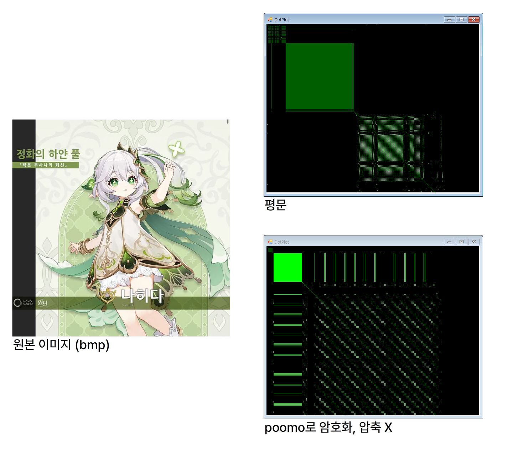

# Poomo
푸모(Poomo)는 ECB 기반 바이너리 암호화 + 선택 가능한 gzip 압축 포맷입니다.

# 특징

- 기본 4-Floor 코드북 암호화 체계이며, 평문 블록과 암호문 블록이 일대일 관계를 유지합니다.
- 암호문을 살펴보는 것만으로도 평문 속에 패턴의 반복이 있다는 것을 알게 되며, 이것을 실마리로 암호를 해독할 수 있게 됩니다. 따라서 Poomo는 **안전한 암호화 방식이 아닙니다.**

  예를 들어, 압축을 하지 않고 이미지를 암호화 한 경우 데이터 마이닝 시도 시 형체가 나오게 됩니다.
- Poomo2에서 AES로 암호화 타입이 바뀌었습니다. 현재 레포지토리는 더 이상 지원되지 않습니다. 

# 알고리즘
- 코드북에는 256 Bytes로 된 플로어가 여러 개 있으며, 한 플로어에는 00h부터 FFh까지의 바이트가 랜덤 셔플된 배열로 들어 있습니다.
- 평문을 1 Byte씩 추출합니다. 해당 Byte의 값만큼 플로어의 어드레스를 이동시켜 그 값(1 Byte)으로 변경합니다.

  이 때, 8 Bytes마다 코드북 플로어 번호를 1씩 증분합니다. 마지막 플로어에 도달한 상태에서 8 Bytes를 채운 경우 첫번째 플로어로 다시 돌아갑니다.
- 암호화된 전체 문장을 거꾸로 돌립니다.

# 구조
## PUMO (Codebook)
 - 0 : PUMO (Magic)
 - 10 (Ah) : Timestamp in big endian
 - 100 (64h) : Codebook Block A
 - 300 (12Ch) : Codebook Block B
 - 700 (2BCh) : Codebook Block C
 - 1000 (3E8h) : Codebook Block D
 - 1290 (50Ah) : FUTAGOHIME (Tail)

## EPUMO (Encrypted Binary)
 - 0 : EPUMO (Magic)
 - 7 : CP (Compress Indicator)
 - 10 (Ah) : Size of File in big endian
 - 100 (64h) : **Reversed** Binary in Encrypted Format
 - END - 10 (Ah) : FUTAGOHIME (Tail)

# 사용 방법
 - newPoomo.py [Output]
 - poomoEncode.py [Poomo] [Victim] [Output] (nocomp)
 - poomoDecode.py [Poomo] [EPUMO] [Output]
